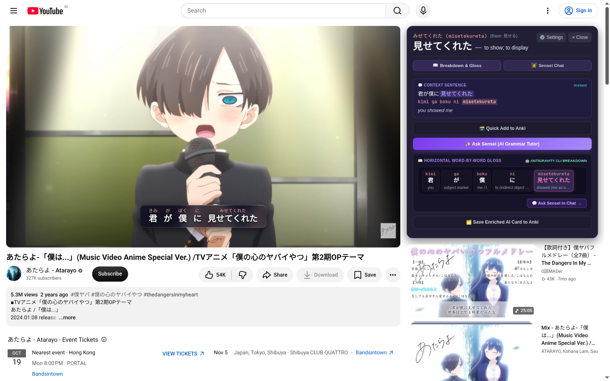
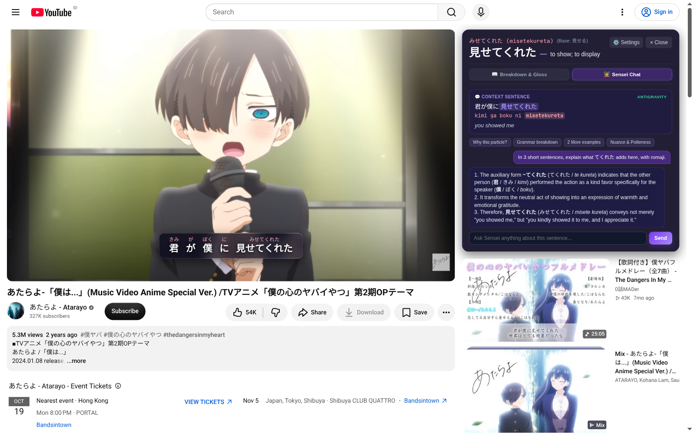

<p align="center">
  
</p>

<h1 align="center">LinguaPlay for YouTube</h1>

<p align="center">
  <strong>Learn Japanese from the videos you already love.</strong><br>
  Clickable subtitles, contextual explanations, and Anki cards — directly on YouTube.
</p>

<p align="center">
  Chrome / Chromium extension · Manifest V3<br>
  <a href="#install-the-extension">Install</a> ·
  <a href="#how-it-works-on-youtube">How it works</a> ·
  <a href="#connect-your-ai-tutor">AI setup</a> ·
  <a href="docs/local-backend.md">Local backend</a>
</p>



*Watch a Japanese video. Click an unfamiliar word. Understand it in context. Keep it for review.*

Screenshots below show LinguaPlay on the real YouTube watch page for [Atarayo — 「僕は...」](https://www.youtube.com/watch?v=5tABGeWbVtQ).

LinguaPlay adds a Japanese learning workspace to YouTube's watch page. Subtitles become words you can click, and a learning drawer sits beside the video with readings, definitions, translation, and AI assistance. You can follow the video and study a line in the same tab.

## How it works on YouTube

### 1. Open a video and read along

Open a YouTube video with Japanese captions. LinguaPlay detects the captions and displays an interactive Japanese overlay with **furigana** above the words.

Use the **言** control in the video player to open LinguaPlay's toolbar. Switch to **Romaji** for alphabetic pronunciation or **Hidden** to practise reading without pronunciation guides. The **eye** control shows or hides the subtitle overlay and learning drawer.

For music videos without captions, click **Lyrics** to search for synced lyrics by track and artist. You can also use the toolbar's **folder** button to load a Japanese `.srt`, `.vtt`, or `.lrc` file. Adjust the timing offset or use **Sync Line 1 to Playhead** in the Lyrics Manager when the text is out of sync.

### 2. Click a word to understand the sentence

Click any word in the subtitle overlay. Playback pauses and LinguaPlay opens its drawer in YouTube's sidebar.

- **Word and reading:** check the Japanese word, hiragana reading, romaji, and dictionary meaning.
- **Context sentence:** see the original line, its romaji, and English translation.
- **Breakdown & Gloss:** click **Ask Sensei (AI Grammar Tutor)** to get an AI word-by-word gloss.

The drawer keeps the sentence you selected as its context, even if playback moves on. When you're ready, close the drawer and resume the video.

### 3. Ask Sensei a follow-up question

Switch to **Sensei Chat** to ask about the selected sentence. Use a prompt such as **Why this particle?**, **Grammar breakdown**, **2 More examples**, or **Nuance & Politeness** — or type your own question.



Sensei uses your chosen AI provider. Its answers depend on the model and should be checked when a reading or explanation seems uncertain.

### 4. Save useful words to Anki

Click **Quick Add to Anki** to save the selected word with its reading, meaning, and sentence context. After an AI breakdown, **Save Enriched AI Card to Anki** saves an enriched card.

With Anki and AnkiConnect running, cards go to your target deck. If AnkiConnect is unavailable, cards are saved in the extension collection. Open the extension popup or Options and choose **Export TSV** to export the collection later. The TSV contains sentence, word, reading, and meaning columns.

## Install the extension

No build step is needed.

1. Clone or download this repository:

   ```bash
   git clone https://github.com/Marsel204/LangPlayeExt.git
   ```

2. Open `chrome://extensions` in Chrome or Chromium.
3. Enable **Developer mode**, click **Load unpacked**, and select the repository root — the folder containing `manifest.json`.
4. Pin **LinguaPlay** to your toolbar.
5. Open **Options / Keys**, choose your AI provider, and click **Save Settings**.
6. Open a YouTube watch page. Refresh an already-open page so the extension can load.

Japanese subtitle interaction, reading modes, and the offline card collection work without an AI API key. AI breakdowns and chat require a configured provider. More accurate contextual readings use the optional Sudachi backend.

## Connect your AI tutor

Click the extension's toolbar icon and open **Options / Keys**. Choose a provider, enter its settings, use the corresponding **Test** button, and click **Save Settings**.

| Provider | Settings |
| --- | --- |
| **Google Gemini API** | Gemini API key; the extension currently uses `gemini-2.5-flash`. |
| **DeepSeek API** | DeepSeek API key; the extension currently uses `deepseek-chat`. |
| **OpenRouter** | API key and model ID; default: `deepseek/deepseek-chat`. |
| **OpenCode / Custom OpenAI Endpoint** | An OpenAI-compatible API base URL, the model ID your server exposes, and a key if required. |
| **Local Antigravity CLI / Server** | The separate companion backend with Antigravity CLI available; default URL: `http://127.0.0.1:8000`. |

The default provider is **Local Antigravity CLI / Server**. Set up the companion backend or select another provider before requesting a breakdown or chat response.

For local AI, automatic server startup on Linux, and offline **Sudachi** parsing, follow the [local backend setup guide](docs/local-backend.md). Sudachi improves contextual readings and dictionary forms. A lightweight fallback keeps subtitles usable when it is unavailable.

For a custom endpoint, use its API base URL, such as `http://127.0.0.1:11434/v1`, and the exact model ID it serves. The Options page includes connection guidance for Ollama and host access.

## Connect Anki

1. Install [AnkiConnect](https://ankiweb.net/shared/info/2055492159) in Anki using add-on code `2055492159`, then restart Anki.
2. Keep Anki open. Its default endpoint is `http://127.0.0.1:8765`.
3. In LinguaPlay Options, set your deck name — default: **LinguaPlay** — and click **Test AnkiConnect**.
4. Save your settings and add a word from the YouTube subtitle drawer.

You can also start with the offline collection and export your cards later.

## Troubleshooting

| Problem | What to try |
| --- | --- |
| **No extension controls** | Reload the extension in `chrome://extensions`, then refresh the YouTube watch page. |
| **No Japanese text** | Enable Japanese captions, search with **Lyrics**, or upload a subtitle file with the folder button. Availability varies by video. |
| **Text is out of sync** | Adjust the toolbar offset or use the Lyrics Manager's playhead sync tools. |
| **AI isn't responding** | Test your selected provider in Options. Check the key, model ID, endpoint, or local server. |
| **A reading looks wrong** | Use the updated Sudachi backend for contextual parsing. Names and ambiguous words may still need checking. |
| **A card isn't in Anki** | Check that AnkiConnect is available. Look in the extension collection for cards saved while Anki was offline. |

## Extension and standalone app

This repository contains the **YouTube extension**. Its popup opens YouTube and searches YouTube directly; all learning tools run on the watch page.

The standalone video player and companion Python backend live in the separate [LangPlay app repository](https://github.com/Marsel204/LangPlay). Use that project for local video playback. The extension connects to its optional backend over HTTP for local AI and Sudachi parsing; it does not bundle or launch the standalone player.

<details>
<summary><strong>Contributor notes and checks</strong></summary>

The extension uses plain JavaScript, HTML, and CSS. `content.js` and `content.css` implement the YouTube interface; `background.js` handles extension requests; `popup.*` and `options.*` provide the popup and settings. `js/` contains the YouTube bridge and parser client, `lib/` contains reading libraries, and `native/` contains the optional Linux backend launcher.

`build_content_js.py` generates `content.js` using the extension's reading data in `data/kanji-dict.js`. When changing the YouTube interface, update the generator and regenerate the bundle:

```bash
python3 build_content_js.py
```

Run the extension checks:

```bash
node --test tests/test_*.js
node run_tests.js
python3 tests/test_native_host.py
node tests/browser_custom_ai.mjs
```

The browser check requires Chromium and uses a disposable profile and local test API. It does not invoke an AI model. Set `CHROMIUM_PATH` if your executable has another name. See the [backend guide](docs/local-backend.md) for real Sudachi integration checks.

</details>
